# RetailIQ AI Platform

> **A smart retail backend platform for demand forecasting, anomaly detection, product support, customer insights, reporting, and cloud deployment.**

RetailIQ AI Platform is built to solve common retail decision-making problems using data, machine learning, and API-based automation. The system works with product, customer, and order data to prepare clean business datasets, train ML models, and expose useful retail intelligence through a FastAPI backend.

The project includes demand forecasting for product planning, anomaly detection for unusual transactions, customer segmentation for business analysis, and an AI-assisted support flow that answers product-related questions using stored product knowledge. It also includes sales and analytics agents that convert model outputs and dashboard metrics into simple business explanations.

The backend is deployed on Azure App Service and connected with MongoDB logging, Power BI reporting, Microsoft Fabric proof, and GitHub Actions CI/CD. This README explains the project structure, data ingestion flow, ML models, API endpoints, agent workflow, deployment setup, and evaluation flow.

---
## Table of contents

1. [Project objective](#1-project-objective)
2. [Final delivered scope](#2-final-delivered-scope)
3. [Business problems solved](#3-business-problems-solved)
4. [Final runtime architecture](#4-final-runtime-architecture)
5. [End-to-end architecture diagram](#5-end-to-end-architecture-diagram)
6. [Repository structure](#6-repository-structure)
7. [Data layer](#7-data-layer)
8. [Machine learning layer](#8-machine-learning-layer)
9. [ML training workflow diagram](#9-ml-training-workflow-diagram)
10. [GenAI and RAG layer](#10-genai-and-rag-layer)
11. [Support RAG workflow diagram](#11-support-rag-workflow-diagram)
12. [Agent and MCP-style orchestration](#12-agent-and-mcp-style-orchestration)
13. [Agent/MCP workflow diagram](#13-agentmcp-workflow-diagram)
14. [FastAPI API surface](#14-fastapi-api-surface)
15. [API surface diagram](#15-api-surface-diagram)
16. [Runtime request sequence](#16-runtime-request-sequence)
17. [MongoDB logging](#17-mongodb-logging)
18. [Microsoft Fabric and Power BI layer](#18-microsoft-fabric-and-power-bi-layer)
19. [Fabric semantic model and report flow diagram](#19-fabric-semantic-model-and-report-flow-diagram)
20. [Power BI report proof](#20-power-bi-report-proof)
21. [Azure AI setup: chat and embedding deployments](#21-azure-ai-setup-chat-and-embedding-deployments)
22. [Azure App Service deployment](#22-azure-app-service-deployment)
23. [Deployment and GitHub Actions CI/CD diagram](#23-deployment-and-github-actions-cicd-diagram)
24. [Live API proof screenshots](#24-live-api-proof-screenshots)
25. [Local setup](#25-local-setup)
26. [Azure App Service environment variables](#26-azure-app-service-environment-variables)
27. [Testing](#27-testing)
28. [Evaluation walkthrough](#28-evaluation-walkthrough)
29. [Security considerations](#29-security-considerations)
30. [Known legacy naming and cleanup notes](#30-known-legacy-naming-and-cleanup-notes)
31. [Roadmap](#31-roadmap)
32. [Final conclusion](#32-final-conclusion)

---

## 1. Project objective

Retail operations often depend on separate systems for forecasting, product support, anomaly review, customer segmentation, and reporting. That creates fragmented decision-making.

RetailIQ was built to connect these layers into one practical smart retail platform:

- raw retail CSV data is transformed into curated analytical datasets
- machine learning models forecast demand, detect anomalies, and segment customers
- a support agent retrieves product knowledge before answering
- sales and analytics agents convert model outputs into business-readable guidance
- MongoDB stores operational traces
- Microsoft Fabric proves the raw-to-curated data engineering flow
- Power BI presents reporting and model/agent insights
- Azure App Service hosts the live FastAPI backend
- GitHub Actions automates deployment

The goal is not to claim that this is a full enterprise product. It is a strong production-inspired capstone system that demonstrates how data engineering, ML, GenAI, APIs, observability, and deployment can work together in a retail setting.

---

## 2. Final delivered scope

The final project includes:

- **FastAPI backend** with a simplified Swagger surface
- **Demand forecasting** API
- **Anomaly detection** API
- **Unified agent endpoint** for support, sales, and analytics
- **Azure chat generation** using `gpt-oss-120b`
- **Azure embeddings** using `text-embedding-3-large`
- **Local JSON vector store** for product knowledge retrieval
- **MongoDB Atlas logging** for predictions and agent outputs
- **MCP-style tool registry and orchestrator** for reusable tools
- **Microsoft Fabric Lakehouse proof** with staged/curated tables
- **Semantic model and relationships** for Power BI reporting
- **Power BI report pages** for executive, demand, risk, customer, and model views
- **Azure App Service deployment** on Linux / Python 3.12
- **GitHub Actions CI/CD** with successful workflow runs

---

## 3. Business problems solved

### 3.1 Demand intelligence

RetailIQ predicts future demand for a selected product and date. This supports:

- stock planning
- procurement decisions
- early demand visibility
- revenue planning
- category-level review

### 3.2 Customer assistance

The support agent answers product-related questions by retrieving product knowledge before generation. It uses product descriptions, category, brand, return-policy text, FAQ answers, and optional review text as grounding context.

### 3.3 Anomaly monitoring

The anomaly layer evaluates transaction-like inputs and returns anomaly flags and anomaly scores. This helps identify operationally unusual orders for review.

### 3.4 Business interpretation

The analytics and sales agents turn model outputs and dashboard metrics into readable business explanations so decision makers do not need to inspect raw model outputs directly.

---

## 4. Final runtime architecture

The final runtime architecture is:

| Layer | Final implementation |
|---|---|
| Backend | FastAPI |
| Serving | Uvicorn locally, Gunicorn on Azure |
| Forecasting | scikit-learn demand model |
| Anomaly detection | scikit-learn anomaly model |
| Customer segmentation | scikit-learn clustering model |
| Chat generation | Azure chat deployment `gpt-oss-120b` |
| Embeddings | Azure `text-embedding-3-large` |
| Retrieval store | local JSON vector store |
| Logs | MongoDB Atlas |
| Data engineering proof | Microsoft Fabric Lakehouse + Notebook + SQL/Semantic model |
| Visualization | Power BI report |
| Deployment | Azure App Service |
| CI/CD | GitHub Actions |

### Important final-runtime note

The final active runtime path does **not** depend on:

- Azure AI Search
- ChromaDB as the active final vector database
- local MiniLM embeddings as the active final embedding model

A legacy script name still exists:

```text
scripts/build_chroma_store.py
```

That name is retained for compatibility, but the final target behavior is to build the **Azure-embedding-powered local JSON vector store**.

---

## 5. End-to-end architecture diagram

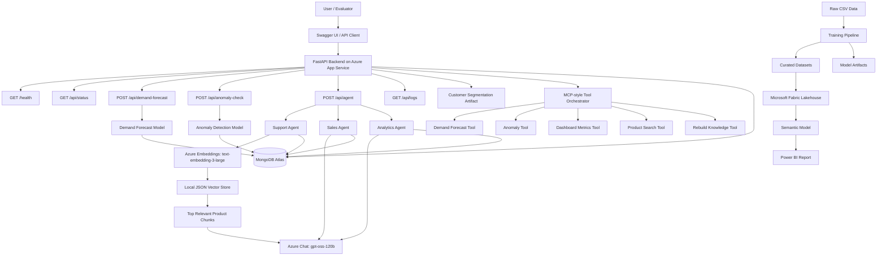
```mermaid
flowchart TD
    User[User / Evaluator] --> Swagger[Swagger UI / API Client]
    Swagger --> FastAPI[FastAPI Backend on Azure App Service]

    FastAPI --> Health[GET /health]
    FastAPI --> Status[GET /api/status]
    FastAPI --> Forecast[POST /api/demand-forecast]
    FastAPI --> Anomaly[POST /api/anomaly-check]
    FastAPI --> Agent[POST /api/agent]
    FastAPI --> Logs[GET /api/logs]

    Forecast --> DemandModel[Demand Forecast Model]
    Anomaly --> AnomalyModel[Anomaly Detection Model]
    FastAPI --> SegmentModel[Customer Segmentation Artifact]

    Agent --> SupportAgent[Support Agent]
    Agent --> SalesAgent[Sales Agent]
    Agent --> AnalyticsAgent[Analytics Agent]

    SupportAgent --> QueryEmbed[Azure Embeddings: text-embedding-3-large]
    QueryEmbed --> VectorStore[Local JSON Vector Store]
    VectorStore --> RetrievedContext[Top Relevant Product Chunks]
    RetrievedContext --> AzureChat[Azure Chat: gpt-oss-120b]

    SalesAgent --> AzureChat
    AnalyticsAgent --> AzureChat

    FastAPI --> MCP[MCP-style Tool Orchestrator]
    MCP --> ToolForecast[Demand Forecast Tool]
    MCP --> ToolAnomaly[Anomaly Tool]
    MCP --> ToolMetrics[Dashboard Metrics Tool]
    MCP --> ToolSearch[Product Search Tool]
    MCP --> ToolKnowledge[Rebuild Knowledge Tool]

    FastAPI --> Mongo[(MongoDB Atlas)]
    DemandModel --> Mongo
    AnomalyModel --> Mongo
    SupportAgent --> Mongo
    SalesAgent --> Mongo
    AnalyticsAgent --> Mongo

    RawCSV[Raw CSV Data] --> Training[Training Pipeline]
    Training --> Curated[Curated Datasets]
    Training --> Artifacts[Model Artifacts]
    Curated --> Fabric[Microsoft Fabric Lakehouse]
    Fabric --> Semantic[Semantic Model]
    Semantic --> PowerBI[Power BI Report]
```

---

## 6. Repository structure

```text
RetailIQ-AI-Platform/
├── artifacts
│   ├── knowledge
│   │   └── product_knowledge_embeddings.json
│   ├── metrics
│   │   └── training_metrics.json
│   ├── models
│   │   ├── anomaly_model.joblib
│   │   ├── clustering_model.joblib
│   │   └── demand_model.joblib
│   └── powerbi_export.csv
├── configs
│   └── config.yaml
├── data
│   ├── curated
│   │   ├── anomaly_dataset.csv
│   │   ├── customer_segments.csv
│   │   ├── demand_dataset.csv
│   │   ├── master_sales_dataset.csv
│   │   └── master_table.csv
│   ├── processed
│   └── raw
│       ├── customer_data.csv
│       ├── order_data.csv
│       ├── product_details.csv
│       └── README.md
├── deployment
│   ├── azure
│   │   ├── app_service_config.md
│   │   ├── deployment_steps.md
│   │   └── how_to_get_azure_keys_and_deploy_models.md
│   └── ci_cd
│       └── github_actions.yml
├── docs
│   └── optional diagram/source documentation files
├── scripts
│   ├── build_chroma_store.py
│   ├── run_api.py
│   └── run_training.py
├── src
│   ├── agents
│   │   ├── analytics_agent
│   │   ├── mcp
│   │   ├── sales_agent
│   │   ├── shared
│   │   └── support_agent
│   ├── api
│   ├── common
│   ├── database
│   ├── ml
│   └── visualization
├── tests
│   └── test_api.py
├── .gitignore
├── README.md
├── requirements.txt
└── START_HERE.md
```

### Structure interpretation

- `data/raw/` contains source CSV files.
- `data/curated/` contains model-ready and report-ready outputs.
- `artifacts/models/` stores trained ML models.
- `artifacts/knowledge/product_knowledge_embeddings.json` is the final local vector retrieval artifact.
- `src/api/main.py` exposes the simplified public Swagger routes.
- `src/agents/support_agent/rag_pipeline.py` orchestrates support RAG.
- `src/agents/support_agent/vector_store.py` handles local vector retrieval.
- `src/agents/shared/llm_client.py` handles Azure chat and Azure embeddings.
- `src/agents/mcp/` contains the MCP-style orchestrator and tool registry.
- `deployment/` stores deployment notes and workflow references.
- `docs/` may store optional source diagrams, but this README embeds all core diagrams directly.

---

## 7. Data layer

### 7.1 Raw input files

| File | Purpose |
|---|---|
| `product_details.csv` | product catalog, brand/category information, FAQ content, return-policy text, review text |
| `customer_data.csv` | customer profile and customer behavior information |
| `order_data.csv` | order transaction history, price, quantity, discount, channel, region, anomaly-related fields |

### 7.2 Curated outputs

| File | Purpose |
|---|---|
| `master_sales_dataset.csv` | main analytical table used for reporting and business summaries |
| `demand_dataset.csv` | forecasting-ready dataset with engineered demand features |
| `anomaly_dataset.csv` | transaction-risk dataset used by anomaly logic |
| `customer_segments.csv` | customer-level segmentation output |
| `master_table.csv` | additional joined analytical output retained for compatibility |

### 7.3 Data transformation logic

The data pipeline performs:

- column normalization
- date conversion
- numeric conversion
- missing-value handling
- product/customer/order joining
- `total_amount` calculation
- promotion and discount features
- lag sales features
- rolling sales features
- anomaly-ready feature creation
- customer-level aggregation
- curated dataset export

---

## 8. Machine learning layer

RetailIQ trains and stores three ML models.

### 8.1 Demand forecasting

- **Model family:** Random Forest Regressor
- **Purpose:** forecast demand for a product/date combination
- **Output:** `predicted_demand` plus feature context

Earlier documented training metrics from the project README state:

| Metric | Value |
|---|---:|
| R2 Score | 0.2586 |
| MAE | 1.4666 |
| RMSE | 3.1151 |

These are baseline project-level forecasting metrics. They are useful for demonstration and planning logic, but enterprise forecasting would normally require a longer time horizon, seasonality features, holiday signals, stronger validation, and production monitoring.

### 8.2 Anomaly detection

- **Model family:** Isolation Forest
- **Purpose:** identify unusual transaction patterns
- **Output:** anomaly flag and anomaly score

Earlier documented metrics include:

| Metric | Value |
|---|---:|
| Accuracy | 95.72% |
| Precision | 56.80% |
| Recall | 57.25% |
| F1 Score | 57.02% |
| Anomaly rate | 5% |

### 8.3 Customer segmentation

- **Model family:** KMeans
- **Purpose:** group customers by behavioral and spending patterns
- **Output:** customer segment information

Earlier documented metric:

| Metric | Value |
|---|---:|
| Silhouette Score | 0.3560 |

### 8.4 Model artifacts

```text
artifacts/models/demand_model.joblib
artifacts/models/anomaly_model.joblib
artifacts/models/clustering_model.joblib
```

---

## 9. ML training workflow diagram

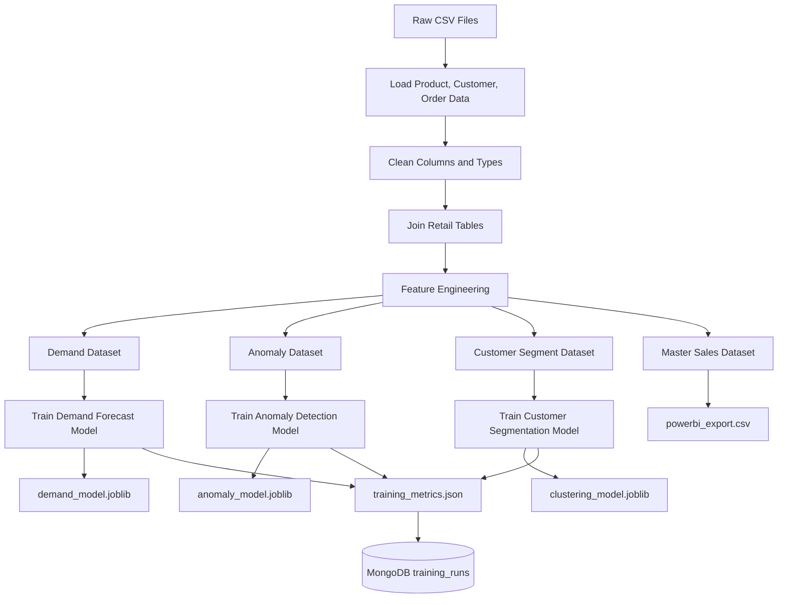
```mermaid
flowchart TD
    A[Raw CSV Files] --> B[Load Product, Customer, Order Data]
    B --> C[Clean Columns and Types]
    C --> D[Join Retail Tables]
    D --> E[Feature Engineering]

    E --> F1[Demand Dataset]
    E --> F2[Anomaly Dataset]
    E --> F3[Customer Segment Dataset]
    E --> F4[Master Sales Dataset]

    F1 --> M1[Train Demand Forecast Model]
    F2 --> M2[Train Anomaly Detection Model]
    F3 --> M3[Train Customer Segmentation Model]

    M1 --> A1[demand_model.joblib]
    M2 --> A2[anomaly_model.joblib]
    M3 --> A3[clustering_model.joblib]

    M1 --> Metrics[training_metrics.json]
    M2 --> Metrics
    M3 --> Metrics

    F4 --> PowerExport[powerbi_export.csv]
    Metrics --> Mongo[(MongoDB training_runs)]
```

---

## 10. GenAI and RAG layer

### 10.1 GenAI role

The ML layer produces numeric outputs. The GenAI layer turns those outputs into business-readable responses:

- support answers
- sales recommendations
- analytics summaries
- executive-style observations
- explanation of model or dashboard outputs

### 10.2 Final Azure chat model

The current project uses:

```text
Azure chat deployment: gpt-oss-120b
```

It is used by:

- support agent
- sales agent
- analytics agent

### 10.3 Final Azure embedding model

The current project uses:

```text
Azure embedding deployment: text-embedding-3-large
```

It is used to:

- embed product knowledge chunks during vector-store build
- embed support questions during retrieval
- find relevant local product chunks through vector similarity

### 10.4 Final RAG behavior

The support agent follows this flow:

1. receive support question
2. generate query embedding through Azure embeddings
3. search local JSON vector store
4. retrieve top product knowledge chunks
5. send question + context to Azure chat
6. return grounded response
7. save chat log to MongoDB

### 10.5 Token-control behavior

The optimized retrieval design keeps token usage controlled by:

- compact product chunks
- limited chunk overlap
- batch embedding at build time
- single query embedding per support request
- top-k retrieval
- similarity thresholding
- shorter final prompt context

---

## 11. Support RAG workflow diagram

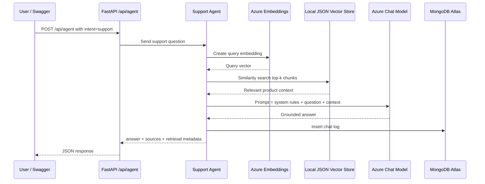
```mermaid
sequenceDiagram
    participant User as User / Swagger
    participant API as FastAPI /api/agent
    participant Support as Support Agent
    participant Embed as Azure Embeddings
    participant Store as Local JSON Vector Store
    participant Chat as Azure Chat Model
    participant Mongo as MongoDB Atlas

    User->>API: POST /api/agent with intent=support
    API->>Support: Send support question
    Support->>Embed: Create query embedding
    Embed-->>Support: Query vector
    Support->>Store: Similarity search top-k chunks
    Store-->>Support: Relevant product context
    Support->>Chat: Prompt = system rules + question + context
    Chat-->>Support: Grounded answer
    Support->>Mongo: Insert chat log
    Support-->>API: answer + sources + retrieval metadata
    API-->>User: JSON response
```

---

## 12. Agent and MCP-style orchestration

RetailIQ includes three main agents.

### 12.1 Support Agent

The support agent:

- answers product and policy questions
- retrieves product context before generating
- avoids unsupported product-policy hallucinations
- logs response metadata

### 12.2 Sales Agent

The sales agent:

- uses demand forecast output
- converts prediction into business-facing guidance
- explains stock and demand direction
- supports sales planning discussions

### 12.3 Analytics Agent

The analytics agent:

- summarizes dashboard metrics
- explains anomaly patterns
- interprets customer segmentation outputs
- converts reporting metrics into executive-readable language

### 12.4 MCP-style tool layer

The MCP-style layer keeps tools separate from agents. It enables reusable functions such as:

- demand forecast tool
- anomaly detection tool
- customer segment tool
- dashboard metrics tool
- product search tool
- rebuild product knowledge tool

This makes the platform easier to maintain because API routes, tools, agents, and model logic are not tightly coupled.

---

## 13. Agent/MCP workflow diagram

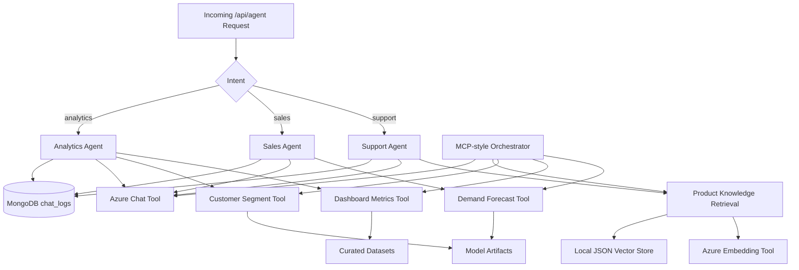
```mermaid
flowchart TD
    Request[Incoming /api/agent Request] --> Intent{Intent}

    Intent -->|support| Support[Support Agent]
    Intent -->|sales| Sales[Sales Agent]
    Intent -->|analytics| Analytics[Analytics Agent]

    Support --> RetrievalTool[Product Knowledge Retrieval]
    RetrievalTool --> EmbeddingTool[Azure Embedding Tool]
    RetrievalTool --> LocalStore[Local JSON Vector Store]
    Support --> ChatTool[Azure Chat Tool]

    Sales --> ForecastTool[Demand Forecast Tool]
    Sales --> ChatTool

    Analytics --> MetricsTool[Dashboard Metrics Tool]
    Analytics --> SegmentTool[Customer Segment Tool]
    Analytics --> ChatTool

    ForecastTool --> Models[Model Artifacts]
    MetricsTool --> Curated[Curated Datasets]
    SegmentTool --> Models

    Support --> Logs[(MongoDB chat_logs)]
    Sales --> Logs
    Analytics --> Logs

    MCP[MCP-style Orchestrator] --> ForecastTool
    MCP --> MetricsTool
    MCP --> SegmentTool
    MCP --> RetrievalTool
    MCP --> ChatTool
```

---

## 14. FastAPI API surface

The live Swagger UI is intentionally simplified into the main routes that matter for evaluation.

| Method | Endpoint | Purpose |
|---|---|---|
| GET | `/health` | service health check |
| GET | `/api/status` | readiness status for data, models, Azure config, retrieval, tools, dashboard metrics |
| POST | `/api/demand-forecast` | generate demand forecast for product/date |
| POST | `/api/anomaly-check` | evaluate transaction anomaly risk |
| POST | `/api/agent` | unified support/sales/analytics agent endpoint |
| GET | `/api/logs` | recent MongoDB activity logs |

### Example: support agent request

```json
{
  "intent": "support",
  "question": "What is the return policy for P001?"
}
```

### Example: sales agent request

```json
{
  "intent": "sales",
  "product_id": "P001",
  "forecast_date": "2026-06-01"
}
```

### Example: analytics agent request

```json
{
  "intent": "analytics",
  "question": "Summarize sales performance, anomaly trends, and customer segment insights."
}
```

---

## 15. API surface diagram

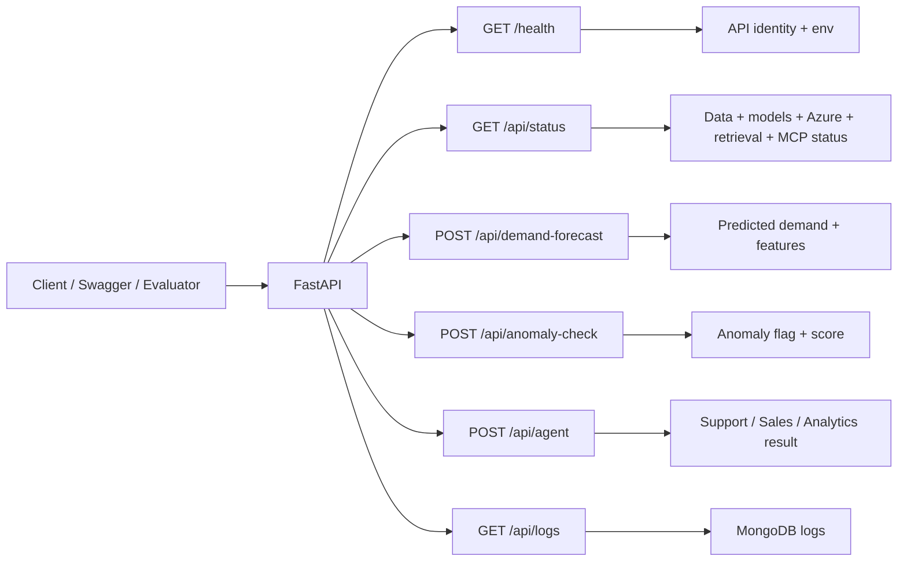
```mermaid
flowchart LR
    Client[Client / Swagger / Evaluator] --> API[FastAPI]

    API --> H[GET /health]
    API --> S[GET /api/status]
    API --> D[POST /api/demand-forecast]
    API --> A[POST /api/anomaly-check]
    API --> G[POST /api/agent]
    API --> L[GET /api/logs]

    H --> HealthResp[API identity + env]
    S --> StatusResp[Data + models + Azure + retrieval + MCP status]
    D --> DemandResp[Predicted demand + features]
    A --> AnomalyResp[Anomaly flag + score]
    G --> AgentResp[Support / Sales / Analytics result]
    L --> LogResp[MongoDB logs]
```

---

## 16. Runtime request sequence

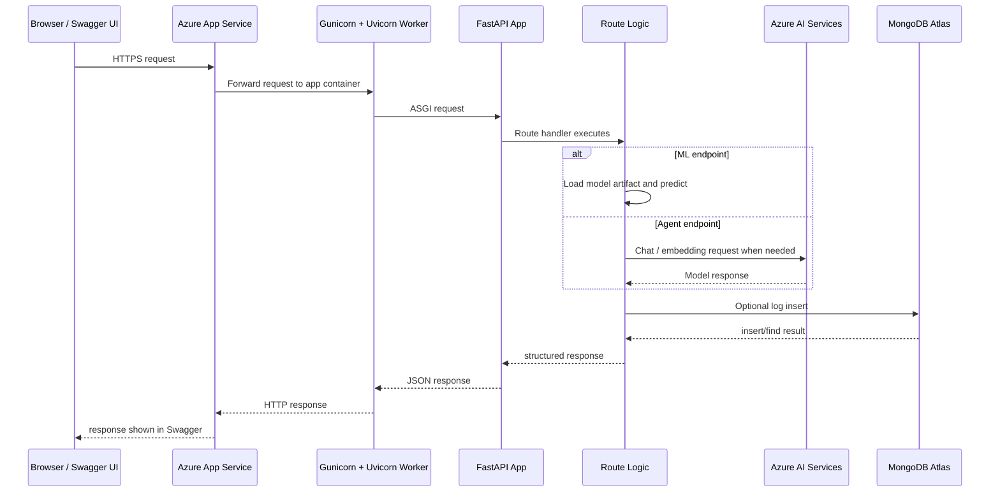
```mermaid
sequenceDiagram
    participant Browser as Browser / Swagger UI
    participant Azure as Azure App Service
    participant Gunicorn as Gunicorn + Uvicorn Worker
    participant FastAPI as FastAPI App
    participant Logic as Route Logic
    participant AI as Azure AI Services
    participant Mongo as MongoDB Atlas

    Browser->>Azure: HTTPS request
    Azure->>Gunicorn: Forward request to app container
    Gunicorn->>FastAPI: ASGI request
    FastAPI->>Logic: Route handler executes

    alt ML endpoint
        Logic->>Logic: Load model artifact and predict
    else Agent endpoint
        Logic->>AI: Chat / embedding request when needed
        AI-->>Logic: Model response
    end

    Logic->>Mongo: Optional log insert
    Mongo-->>Logic: insert/find result
    Logic-->>FastAPI: structured response
    FastAPI-->>Gunicorn: JSON response
    Gunicorn-->>Azure: HTTP response
    Azure-->>Browser: response shown in Swagger
```

---

## 17. MongoDB logging

MongoDB Atlas acts as the operational logging layer.

### Collections

| Collection | Purpose |
|---|---|
| `training_runs` | training metadata and model metrics references |
| `predictions` | demand and anomaly prediction logs |
| `chat_logs` | support, sales, and analytics agent logs |
| `dashboard_cache` | optional cached dashboard metrics |

### Why logging matters

Logging proves that the platform is not only returning API responses but also preserving operational traces. This is useful for:

- auditability
- debugging
- demo proof
- monitoring previous agent outputs
- reviewing model usage patterns

---

## 18. Microsoft Fabric and Power BI layer

The project also includes a data engineering and reporting proof using Microsoft Fabric and Power BI.

### Fabric pieces demonstrated

- Lakehouse
- SQL analytics endpoint
- Notebook
- Semantic model
- Report

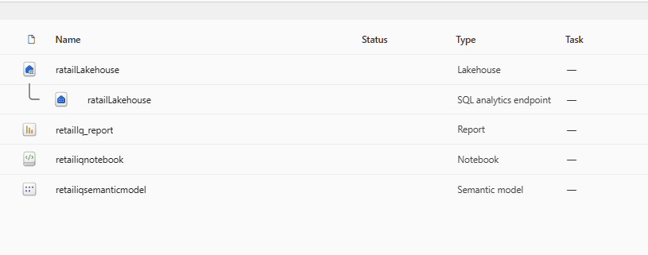

### Semantic model relationship proof

The semantic model connects curated master sales data with staged product and customer tables. This supports star-schema style reporting and DAX measures.

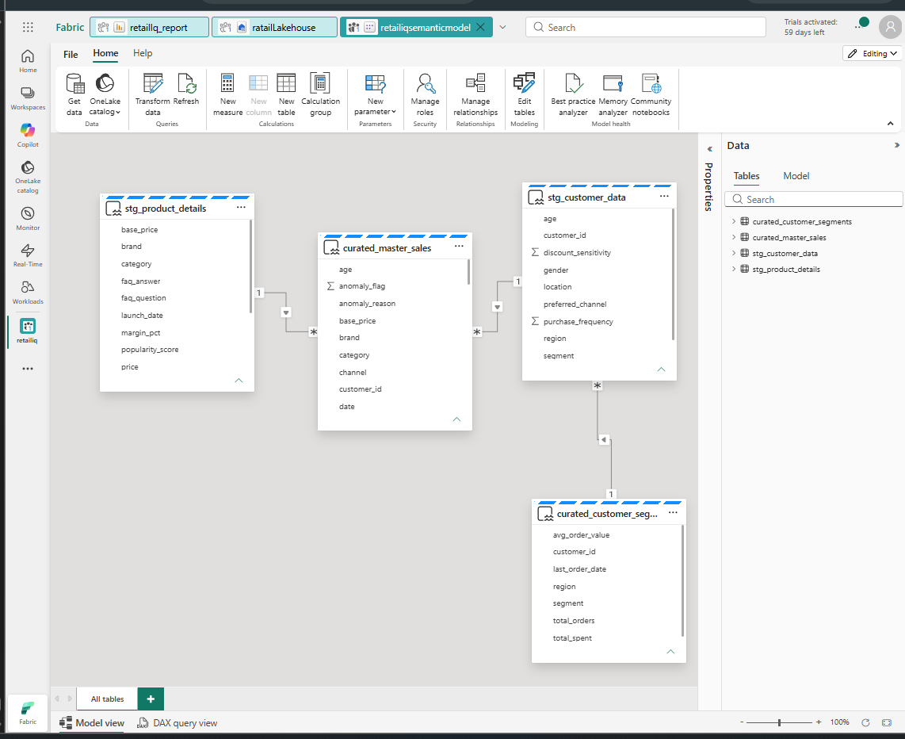

### Semantic model tables visible in proof

- `curated_master_sales`
- `stg_product_details`
- `stg_customer_data`
- `curated_customer_segments`

### Report pages built

The Power BI/Fabric report includes pages for:

1. Executive Overview
2. Demand & Sales View
3. Risk & Anomaly View
4. Customer Insights
5. Model & Agent Insights

---

## 19. Fabric semantic model and report flow diagram

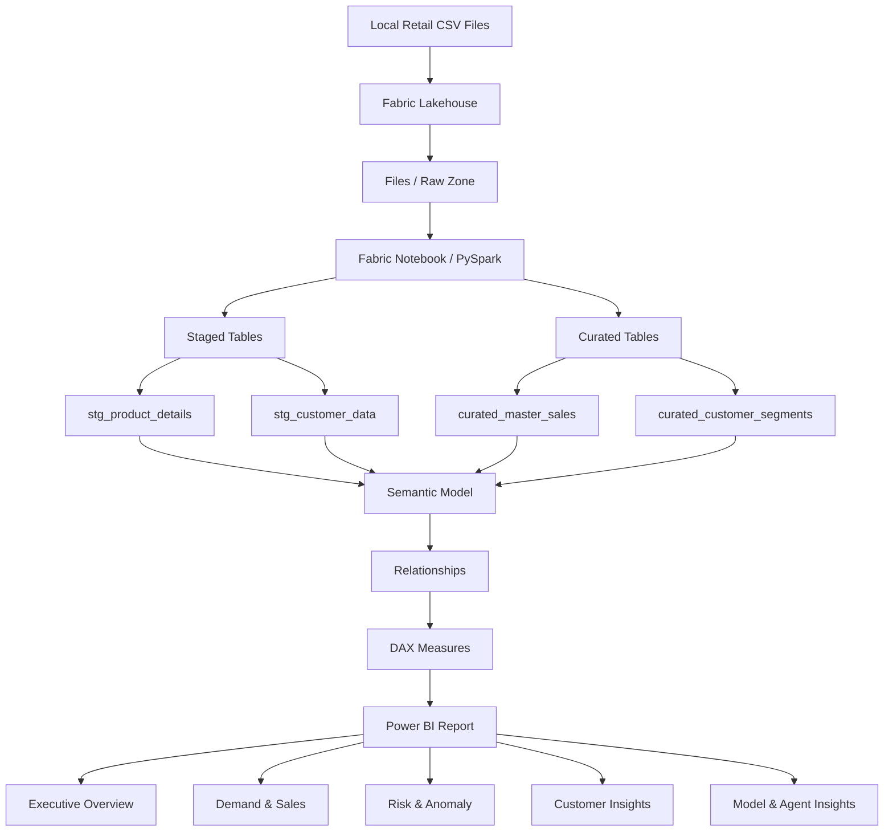
```mermaid
flowchart TD
    LocalCSV[Local Retail CSV Files] --> Lakehouse[Fabric Lakehouse]
    Lakehouse --> FilesRaw[Files / Raw Zone]
    FilesRaw --> Notebook[Fabric Notebook / PySpark]
    Notebook --> Staged[Staged Tables]
    Notebook --> Curated[Curated Tables]

    Curated --> MasterSales[curated_master_sales]
    Curated --> CustomerSegments[curated_customer_segments]
    Staged --> ProductTable[stg_product_details]
    Staged --> CustomerTable[stg_customer_data]

    MasterSales --> Semantic[Semantic Model]
    ProductTable --> Semantic
    CustomerTable --> Semantic
    CustomerSegments --> Semantic

    Semantic --> Relationships[Relationships]
    Relationships --> DAX[DAX Measures]
    DAX --> Report[Power BI Report]

    Report --> Page1[Executive Overview]
    Report --> Page2[Demand & Sales]
    Report --> Page3[Risk & Anomaly]
    Report --> Page4[Customer Insights]
    Report --> Page5[Model & Agent Insights]
```

---

## 20. Power BI report proof

The uploaded Power BI report proof contains five report pages.

### 20.1 Executive overview

The executive overview page shows:

- Total Revenue: **44.80M**
- Total Orders: **3K**
- Total Customers: **451**
- Average Order Value: **14.58K**
- Revenue by category
- Revenue by region
- Monthly trend filters
- Region/category/segment slicers

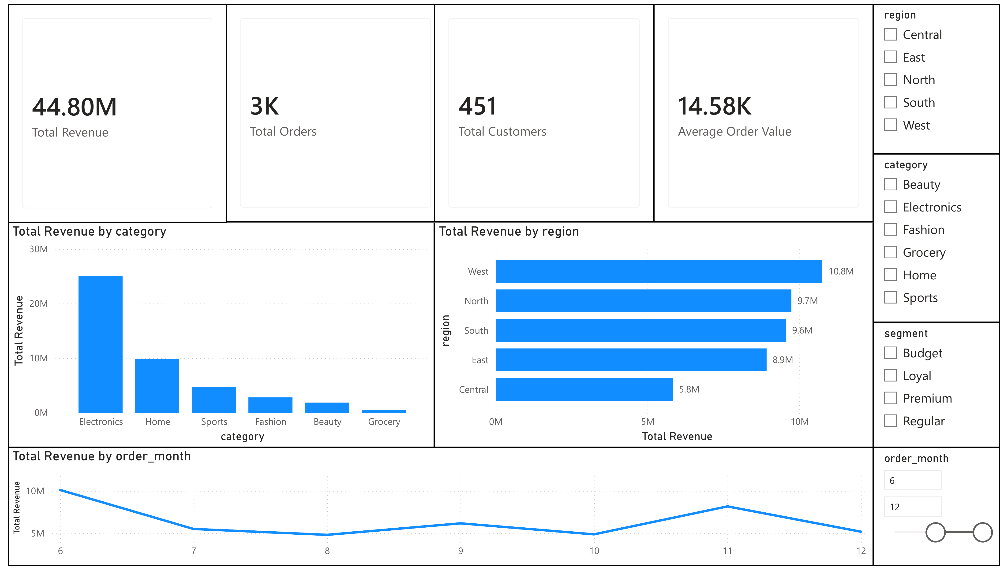

### 20.2 Demand & sales view

The demand page shows:

- demand feature snapshot by product
- lag sales features
- total quantity by product
- price vs quantity distribution
- category and region slicers
- Total Quantity: **13.32K**
- Average Lag: **2.66**

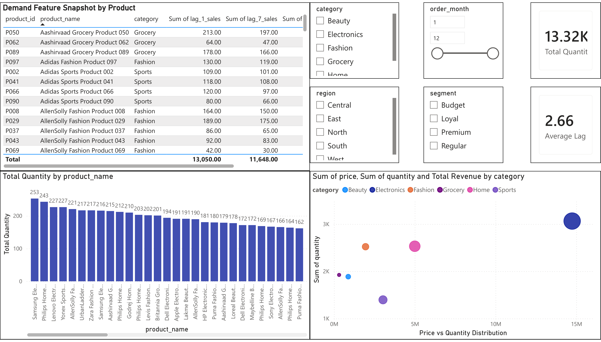

### 20.3 Risk & anomaly view

The risk page shows:

- anomaly flag distribution
- transaction risk distribution
- discount patterns by category
- customer counts by anomaly flag and payment method
- flagged order filter
- regional anomaly/revenue table

The visible table reports **248 flagged anomaly records** in the anomaly group.

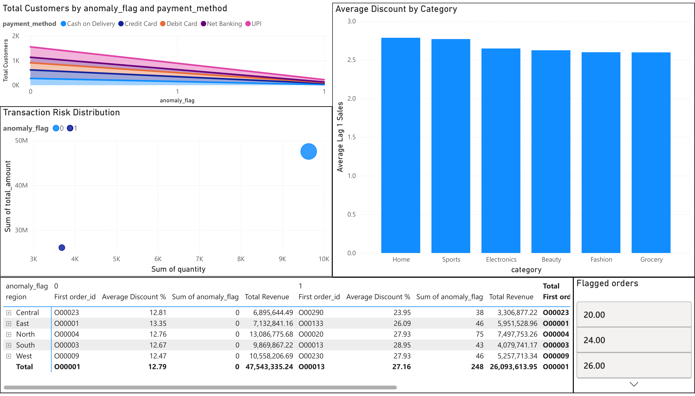

### 20.4 Customer insights view

The customer page shows:

- Total Customers: **482**
- Average Order Value: **14.73K**
- customer count by segment and region
- revenue by segment and brand
- customer spend vs order frequency
- detailed customer table

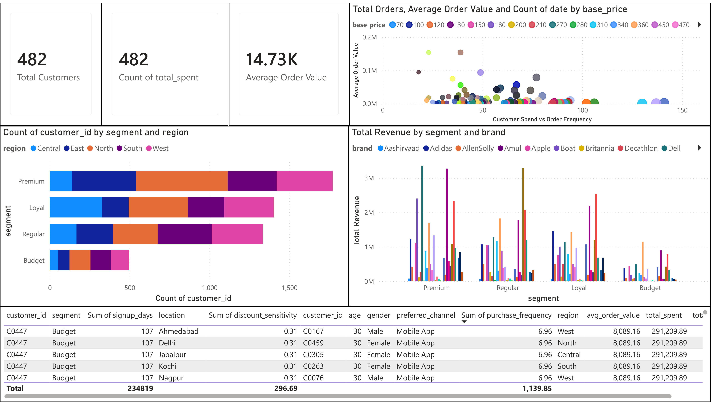

### 20.5 Model & agent insights view

The model/agent page shows:

- Average Lag 1 Sales: **2.66**
- Average Rolling 7 Sales: **2.68**
- Average Margin: **0.22**
- Average Discount: **13.50**
- Sum of Lag 7 Sales: **11.65K**
- Revenue YTD: **73.64M**
- category-level margin and rolling sales view
- category distribution chart

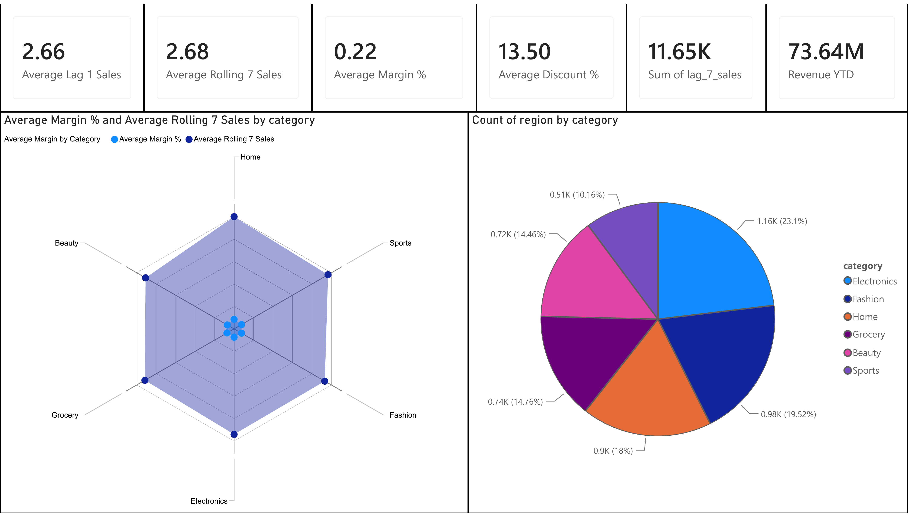

---

## 21. Azure AI setup: chat and embedding deployments

This project uses two Azure AI deployments:

| Purpose | Deployment used |
|---|---|
| Chat / generation | `gpt-oss-120b` |
| Embeddings | `text-embedding-3-large` |

### 21.1 Create Azure AI resource / Foundry project

Recommended setup flow:

1. Open Azure Portal.
2. Create or open an Azure AI Foundry / Azure AI Services resource.
3. Open the resource in Azure AI Foundry.
4. Go to **Build** / **Deployments** / **Model catalog**.
5. Deploy required models.
6. Copy endpoint, key, and deployment name.
7. Add them to local `.env` and Azure App Service App Settings.

### 21.2 Deploy chat model

Use the chat model deployment for final answer generation.

Recommended deployment for this project:

```text
Model / deployment name: gpt-oss-120b
```

The screenshot below shows the deployed chat model in Foundry.

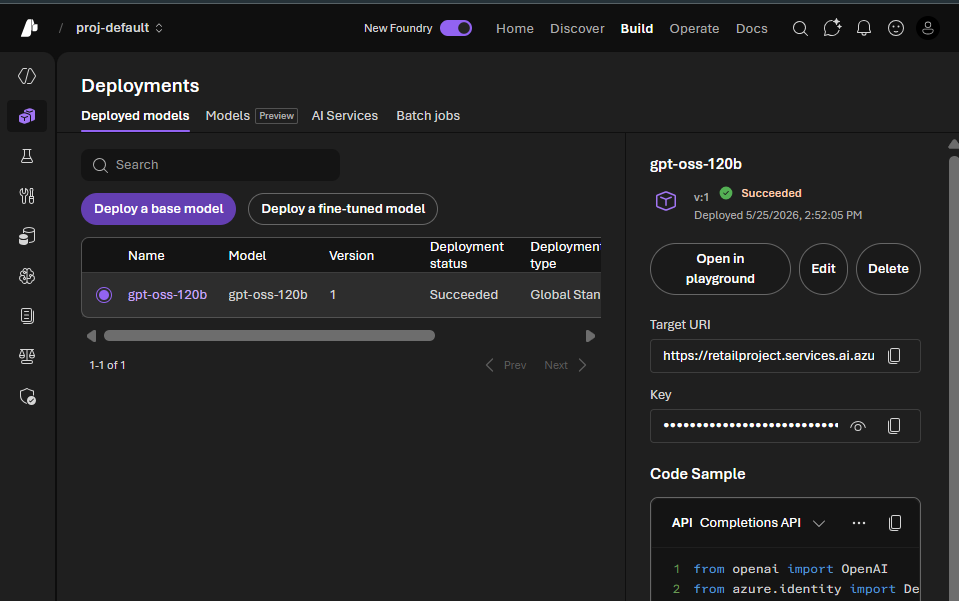

### 21.3 Chat environment variables

```env
AZURE_OPENAI_API_KEY=your_chat_key
AZURE_OPENAI_BASE_URL=https://your-chat-resource.services.ai.azure.com/openai/v1/
AZURE_OPENAI_CHAT_MODEL=gpt-oss-120b
AZURE_OPENAI_MODEL=gpt-oss-120b
```

### 21.4 Deploy embedding model

Use the embedding model deployment for product knowledge indexing and query embedding.

Recommended deployment for this project:

```text
Model / deployment name: text-embedding-3-large
```

The screenshot below shows the embedding model deployment page with endpoint and key panel.

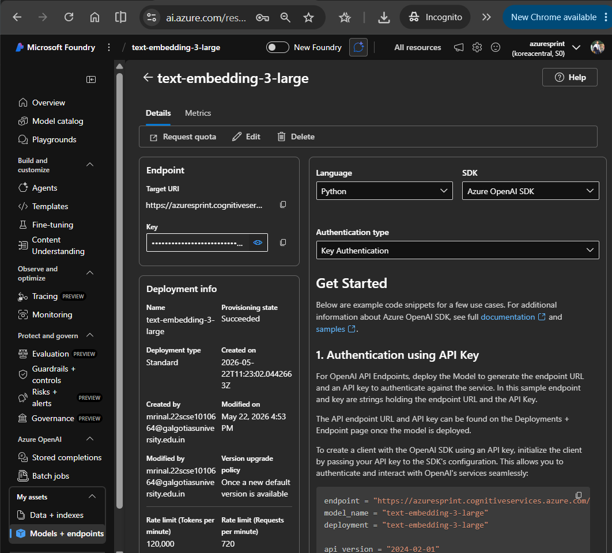

### 21.5 Embedding environment variables

```env
AZURE_OPENAI_EMBEDDING_API_KEY=your_embedding_key
AZURE_OPENAI_EMBEDDING_BASE_URL=https://your-embedding-resource.cognitiveservices.azure.com/
AZURE_OPENAI_EMBEDDING_MODEL=text-embedding-3-large
AZURE_OPENAI_EMBEDDING_DEPLOYMENT=text-embedding-3-large
AZURE_OPENAI_EMBEDDING_API_VERSION=2024-02-01
```

### 21.6 Why separate chat and embedding variables exist

The chat deployment and embedding deployment may come from different Azure resources or different endpoint formats. Keeping them separate avoids endpoint/key mismatch problems and makes debugging easier.

---

## 22. Azure App Service deployment

The backend is deployed on Azure App Service with Python 3.12 on Linux.

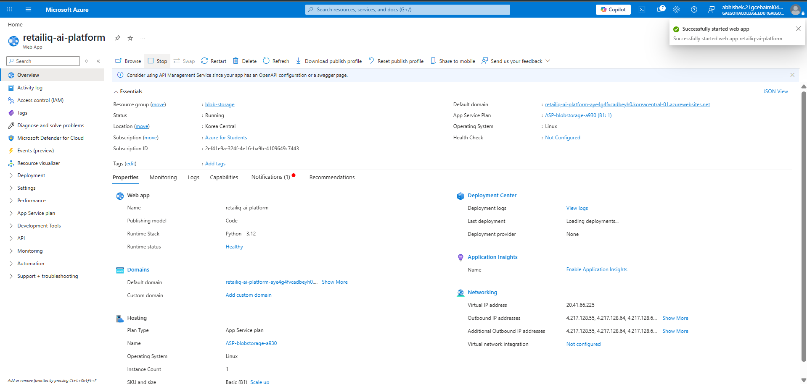

### 22.1 Startup command

```bash
gunicorn -w 1 -k uvicorn.workers.UvicornWorker -b 0.0.0.0:8000 src.api.main:app --timeout 180
```

### 22.2 App Service settings

The final cloud environment needs:

- application settings
- MongoDB URI
- Azure chat endpoint/key/model
- Azure embedding endpoint/key/model
- product knowledge store path
- port/startup settings

### 22.3 Important Azure path

For Azure App Service, use an absolute store path:

```text
PRODUCT_KNOWLEDGE_STORE_PATH=/home/site/wwwroot/artifacts/knowledge/product_knowledge_embeddings.json
```

For local development, use:

```text
PRODUCT_KNOWLEDGE_STORE_PATH=artifacts/knowledge/product_knowledge_embeddings.json
```

---

## 23. Deployment and GitHub Actions CI/CD diagram

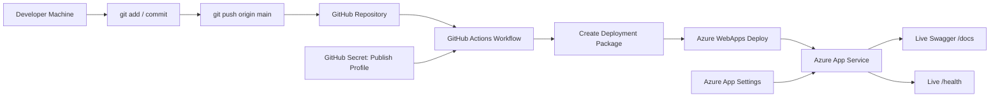
```mermaid
flowchart LR
    Dev[Developer Machine] --> Commit[git add / commit]
    Commit --> Push[git push origin main]
    Push --> GitHub[GitHub Repository]
    GitHub --> Actions[GitHub Actions Workflow]
    Actions --> Package[Create Deployment Package]
    Package --> Deploy[Azure WebApps Deploy]
    Deploy --> AppService[Azure App Service]
    AppService --> Swagger[Live Swagger /docs]
    AppService --> Health[Live /health]

    Secrets[GitHub Secret: Publish Profile] --> Actions
    AppSettings[Azure App Settings] --> AppService
```

### CI/CD proof

The workflow history shows successful GitHub Actions runs.

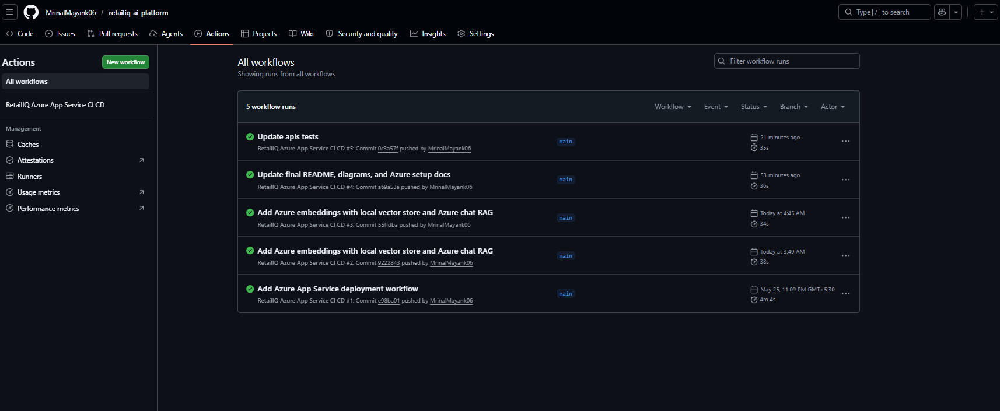

---

## 24. Live API proof screenshots

### 24.1 Swagger surface

The Swagger UI exposes the clean endpoint categories:

- Platform Operations
- Forecasting
- Risk Monitoring
- Retail Assistant
- Observability

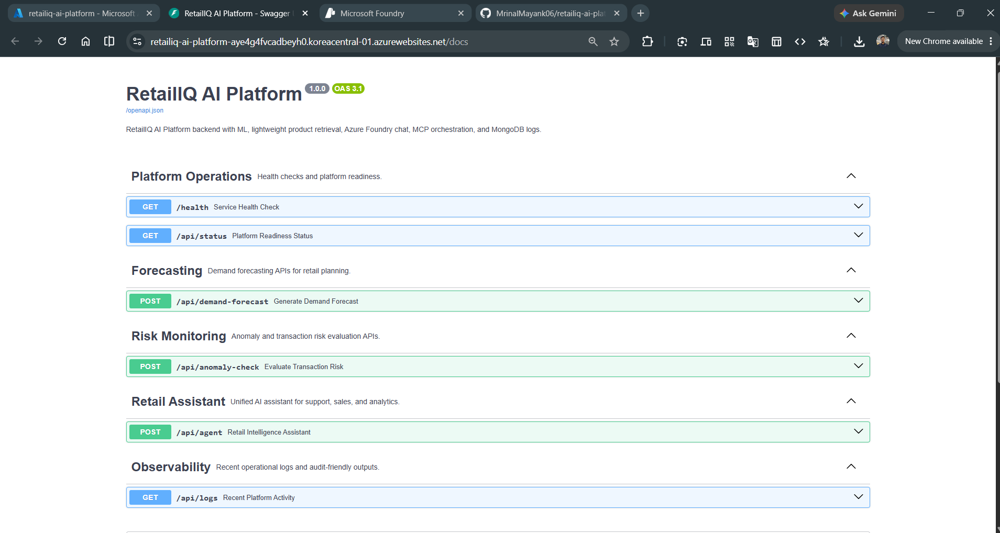

### 24.2 Health endpoint

The `/health` endpoint returns a successful response with app identity.

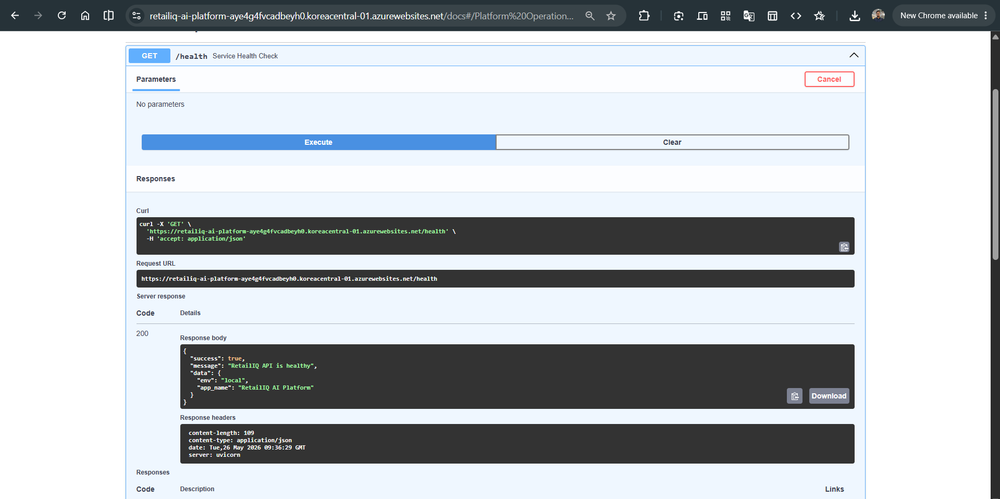

### 24.3 Platform status endpoint

The `/api/status` endpoint returns readiness information for raw files, curated files, model files, Azure configuration, retrieval components, MCP tools, and dashboard metrics.

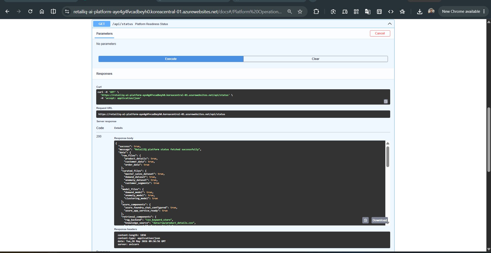

### 24.4 Demand forecast endpoint

The demand forecast example returns product/date output, predicted demand, and feature context.

Visible proof example:

- product id: `P001`
- forecast date: `2026-06-01`
- predicted demand: `2.25`
- feature context includes category, brand, region, channel, price, lag, rolling average, discount, margin, and popularity information

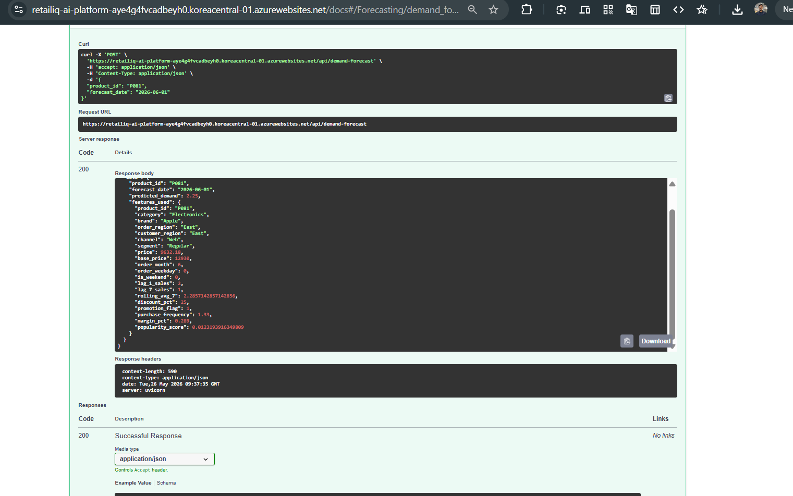

### 24.5 Anomaly check endpoint

The anomaly example returns:

- quantity: `80`
- price: `1500`
- total amount: `120000`
- anomaly flag: `true`
- anomaly score: `-0.7567`

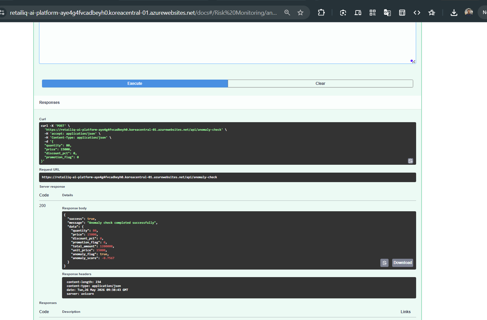

### 24.6 Retail assistant endpoint

The unified agent endpoint accepts support, sales, and analytics intents.

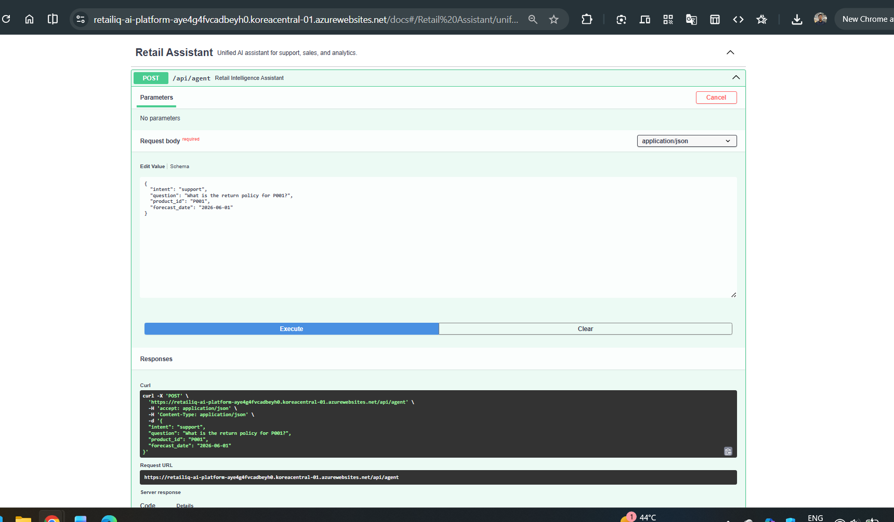

### 24.7 Observability logs endpoint

The logs endpoint returns recent MongoDB activity. Some historical rows may show earlier retrieval experiments or fallback paths; those rows are useful audit history and should not be confused with the final intended architecture.

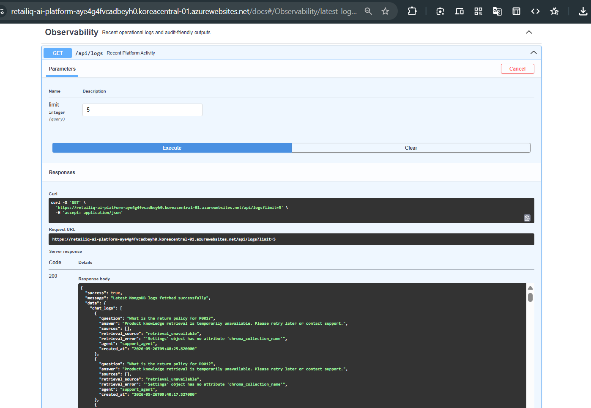

---

## 25. Local setup

### 25.1 Create virtual environment

```powershell
python -m venv .venv
.venv\Scripts\Activate.ps1
```

### 25.2 Install dependencies

```powershell
pip install -r requirements.txt
```

### 25.3 Create `.env`

```env
APP_NAME=RetailIQ AI Platform
APP_ENV=local
APP_HOST=127.0.0.1
APP_PORT=8000

MONGODB_URI=your_mongodb_uri
MONGODB_DB=retailiq

AZURE_OPENAI_API_KEY=your_chat_key
AZURE_OPENAI_BASE_URL=https://your-chat-resource.services.ai.azure.com/openai/v1/
AZURE_OPENAI_CHAT_MODEL=gpt-oss-120b
AZURE_OPENAI_MODEL=gpt-oss-120b

AZURE_OPENAI_EMBEDDING_API_KEY=your_embedding_key
AZURE_OPENAI_EMBEDDING_BASE_URL=https://your-embedding-resource.cognitiveservices.azure.com/
AZURE_OPENAI_EMBEDDING_MODEL=text-embedding-3-large
AZURE_OPENAI_EMBEDDING_DEPLOYMENT=text-embedding-3-large
AZURE_OPENAI_EMBEDDING_API_VERSION=2024-02-01

PRODUCT_KNOWLEDGE_STORE_PATH=artifacts/knowledge/product_knowledge_embeddings.json
```

### 25.4 Train models

```powershell
python -m scripts.run_training
```

### 25.5 Build vector store

```powershell
python -m scripts.build_chroma_store
```

### 25.6 Run API locally

```powershell
python -m scripts.run_api
```

Open:

```text
http://127.0.0.1:8000/docs
```

---

## 26. Azure App Service environment variables

Use placeholders in documentation and store real values only in Azure App Service settings or local `.env`.

```text
APP_NAME=RetailIQ AI Platform
APP_ENV=prod
APP_HOST=0.0.0.0
APP_PORT=8000
WEBSITES_PORT=8000
SCM_DO_BUILD_DURING_DEPLOYMENT=true
WEBSITES_CONTAINER_START_TIME_LIMIT=1800

MONGODB_URI=<mongodb atlas uri>
MONGODB_DB=retailiq

AZURE_OPENAI_API_KEY=<chat key>
AZURE_OPENAI_BASE_URL=https://<chat-resource>.services.ai.azure.com/openai/v1/
AZURE_OPENAI_CHAT_MODEL=gpt-oss-120b
AZURE_OPENAI_MODEL=gpt-oss-120b

AZURE_OPENAI_EMBEDDING_API_KEY=<embedding key>
AZURE_OPENAI_EMBEDDING_BASE_URL=https://<embedding-resource>.cognitiveservices.azure.com/
AZURE_OPENAI_EMBEDDING_MODEL=text-embedding-3-large
AZURE_OPENAI_EMBEDDING_DEPLOYMENT=text-embedding-3-large
AZURE_OPENAI_EMBEDDING_API_VERSION=2024-02-01

PRODUCT_KNOWLEDGE_STORE_PATH=/home/site/wwwroot/artifacts/knowledge/product_knowledge_embeddings.json
```

---

## 27. Testing

Run tests with:

```powershell
python -m pytest -q
```

The expected result is that all API tests pass before pushing or deploying.

---

## 28. Evaluation walkthrough

A clear evaluation sequence is:

1. Explain the business problem.
2. Show the end-to-end architecture diagram.
3. Explain raw, curated, and artifact folders.
4. Show model artifacts and ML role.
5. Explain Azure chat and embedding deployments.
6. Explain support RAG flow.
7. Explain sales and analytics agents.
8. Explain MCP-style tool orchestration.
9. Open live Swagger.
10. Run `/health`.
11. Run `/api/status`.
12. Run `/api/demand-forecast`.
13. Run `/api/anomaly-check`.
14. Run `/api/agent` for support/sales/analytics.
15. Run `/api/logs`.
16. Show Fabric workspace and semantic model.
17. Show Power BI report pages.
18. Show GitHub Actions successful deployments.
19. Discuss security and roadmap.

---

## 29. Security considerations

### Local security

- store secrets in `.env`
- keep `.env` out of Git
- do not hardcode keys in source code
- rotate any accidentally exposed key immediately

### Azure security

- store runtime values in App Service environment variables
- use Azure Key Vault as a recommended future improvement
- use managed identity in future for stronger access control

### Sensitive values

- `MONGODB_URI`
- `AZURE_OPENAI_API_KEY`
- `AZURE_OPENAI_EMBEDDING_API_KEY`

### If a secret is exposed

1. rotate Azure chat key
2. rotate Azure embedding key
3. rotate MongoDB password / URI
4. update local `.env`
5. update Azure App Service settings
6. restart the web app

---

## 30. Known legacy naming and cleanup notes

### 30.1 Legacy script name

The file:

```text
scripts/build_chroma_store.py
```

is retained for compatibility with the earlier project flow. The final intended function is building the local JSON vector store using Azure embeddings.

### 30.2 Old artifacts

If present locally, the following should not be treated as final active runtime dependencies:

- old Chroma persistence folder
- old TF-IDF artifacts
- `__pycache__` folders
- temporary cache folders

### 30.3 Why Mermaid diagrams are inside README

GitHub renders Mermaid diagrams on the repository homepage only when they are embedded directly inside `README.md`. Keeping diagrams only as `.mmd` files under `docs/` does not automatically render them on the repo homepage.

This README therefore embeds the important diagrams directly.

---

## 31. Roadmap

### Phase 1 - Current delivered platform

- demand forecasting
- anomaly monitoring
- support RAG
- sales and analytics agents
- MongoDB logs
- Azure deployment
- Fabric and Power BI proof

### Phase 2 - Intelligence expansion

- stronger time-series features
- deeper anomaly explanation
- larger product knowledge base
- automatic report refresh
- richer customer behavior features

### Phase 3 - Production hardening

- authentication and authorization
- Azure Key Vault integration
- managed identity
- Application Insights
- structured observability
- CI/CD testing gate
- scheduled retraining
- multi-store support

---

## 32. Final conclusion

RetailIQ AI Platform is a connected Smart Retail Assistant that combines:

- machine learning
- retrieval-augmented generation
- multi-agent orchestration
- MongoDB logging
- FastAPI APIs
- Azure-hosted chat and embeddings
- Microsoft Fabric data engineering proof
- Power BI reporting
- Azure App Service deployment
- GitHub Actions CI/CD

It helps retail teams forecast demand, detect unusual transactions, answer product questions, interpret business performance, and review operational logs from one connected platform.

The project is best presented as a strong production-inspired retail intelligence platform that demonstrates how modern Data + AI engineering components can work together in a realistic end-to-end system.
